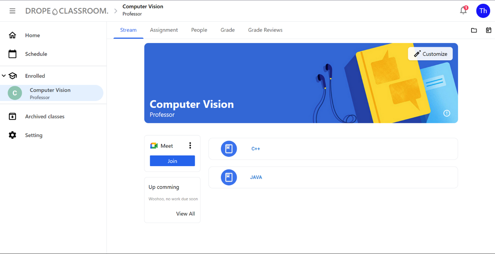
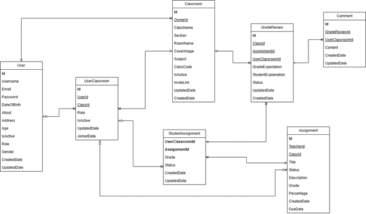

# 🏫 DROPE CLASSROOM PROJECT

Drope Classroom is designed to provide an online learning platform for educators, teachers, and students.We believe that an online learning platform, where students and educators can communicate and study effectively, is crucial, especially in the current edge technology age. Drope classroom will empowers educators to enhance their impact, facilitating communication, collaboration with students and teachers, supporting manage educational resources effectively.

# 💡 Features

- User authentication:
  - Secure user authentication for teachers and students
  - Account creation, login, and recovery password functionality
- Class creation and management:
  - Teacher can create virtual classrooms, where students can engage to study from anywhere.
  - Each class can have a unique name, unique mission, and code for easy identification.
  - Teachers can add and remove students from their class by email or by class code neither.
- Posts:
  - Ability to post assignments, grade reviews, and comments.
- Notifications
- Real-time notifications for new assignments, grade reviews and comments
- Admin Management:
  - Easy manage classrooms, user accounts by admin dashboard.
- Security and Privacy:
  - Encryption of sensitive data (e.g: password).
  - Strict access controls to ensure data privacy
- Technologies used:
  - Frontend: using `ReactJS` as the frontend framework.
  - Backend: using `NestJS` as the backend development

# 🖥️ UI/UX



# Connect to database

In this project, we design the database to address requirements. The design diagram can be seen in the image above.



Use Create a file `./backend/.env` with DB_URL= **connect string from your MongoDB**

# ⚙️ How to run

* Client
```
npm run server
```

* Server
```
npm run start:dev
```
